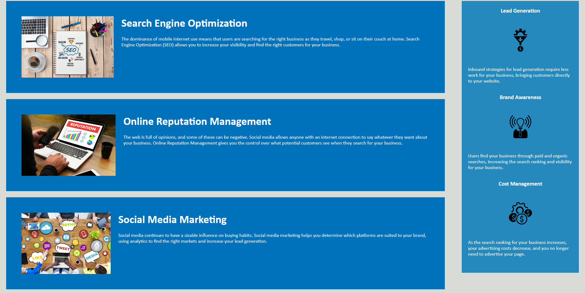

# Horiseon Homepage
## Description
For my first homework assignment, I was instructed to take some code for an existing website and fix it so that the website would meet accessibility standards and the CSS code wouldn't be so cluttered and repetitive.
### Why did I do this project?
I did this for two reasons.
1. I wanted to learn about how I could make a website that is both accessible to people with disabilities and optimized for search engines like Google or Yahoo!.
2. I wanted to learn how I can consolidate CSS code so it isn't repetitive.
### What problem does this solve?
The website previously did not sufficiently meet accessibility standards, nor was it optimized for search engines, so I did research on accessibility standards for websites and did my best to apply them here. There was also the problem of the CSS being needlessly cluttered, so I made sure to put any elements that had the exact same CSS rules into one group to thin out the code a little.
### What did I learn?
I learned about accessibility standards, such as making sure that the font size is big enough and the contrast between the background and the text is sufficient, and how to apply them to a webpage. I also learned that if a bunch of elements or classes have the exact same CSS rules, then I can group those elements and classes together for easier reading by separating them with commas so they will all still have the same CSS rules. Finally, I learned how to add comments so other web developers can see what the code is doing and/or how it's being stylized.
## Screenshot

## Installation
N/A
## Usage
You can use this website to learn a little bit about search engine optimization (SEO).
## Credits
Link to original code: https://github.com/coding-boot-camp/urban-octo-telegram
## License
This uses the MIT license.
